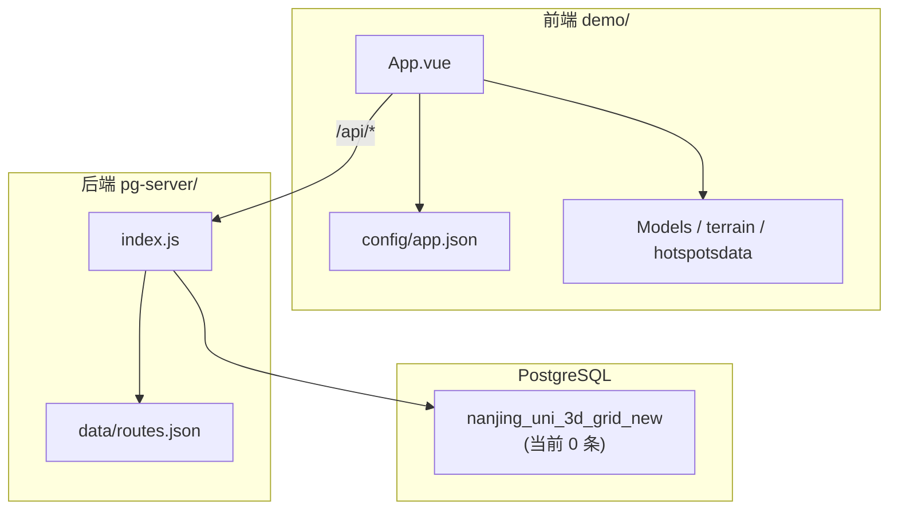

# 仙林校区无人机适航评估平台 — 项目进度报告

> **项目名称**：仙林校区无人机适航评估平台  
> **技术栈**：Vue 3 + Cesium 1.95 + Express + PostgreSQL 18  
> **文档日期**：2026-06-03  
> **综合完成度**：约 **85%**（核心 Web 平台可用；格网真实数据待重新导入）

---

## 一、项目目标

基于三维 GIS 与适航格网数据，构建一个可在浏览器中运行的**仙林校区无人机适航评估演示平台**，实现：

- 三维校园场景展示（地形、建筑、航线、无人机）
- 适航格网视口加载与评分可视化
- 热力图时序播放
- 飞行航线规划展示与逐航点适航评估

---

## 二、总体进度概览

```
整体进度  █████████████████░░░  85%

├─ 前端三维平台 (demo/)          ████████████████████  95%
├─ 后端 API (pg-server/)         ████████████████████  95%
├─ 数据库与格网数据               ████████░░░░░░░░░░░░  40%  ⚠ 表结构在，数据待导入
├─ 三维资产 (模型/地形/Tiles)     ██████████████░░░░░░  70%
├─ 运维与部署                     ████░░░░░░░░░░░░░░░░  20%
└─ 文档与测试                     ████████████░░░░░░░░  60%
```

| 状态 | 数量 | 说明 |
|------|------|------|
| ✅ 已完成 | 18 项 | 见第三节 |
| 🔄 进行中 | 3 项 | 格网数据恢复、UI 联调、文档完善 |
| ⏳ 待其他成员 | 12 项 | 见第五节 |

---

## 三、已完成工作

### 3.1 前端平台（`demo/`）

| 模块 | 文件 | 完成内容 | 状态 |
|------|------|----------|------|
| **主界面** | `src/App.vue` | 从原型 `App2.vue` 重构为完整平台 UI：顶栏状态、左侧控制面板、适航图例、进度条、Toast 提示 | ✅ |
| **Cesium 三维引擎** | `src/App.vue` | Viewer 初始化、Cesium Ion 底图、相机飞到校区、图层开关 | ✅ |
| **校园 GLB 模型** | `src/App.vue` + `public/Models/` | 默认加载 `campus-model2.glb`（scale=100，白色材质），替代早期误用的 GeoJSON 占位 | ✅ |
| **简易建筑 GeoJSON** | `public/data/campus-buildings.geojson` | 12 栋建筑 extruded 占位（可选图层，默认关闭） | ✅ |
| **本地地形** | `public/terrain/` | Cesium 地形加载，支持贴地显示 | ✅ |
| **热力图时序** | `src/App.vue` | 168 帧 CSV 索引自动生成功能；Canvas 热力渲染；上一帧/下一帧；`H` 快捷键 | ✅ |
| **适航格网渲染** | `src/App.vue` | 视口 bbox 按需加载；批量 Primitive 渲染；5 级配色；透明度/高度过滤滑块 | ✅ |
| **飞行航线** | `src/App.vue` | 3 条示范航线；Catmull-Rom 曲线；发光路径；无人机沿航线飞行动画 | ✅ |
| **航线适航评估** | `src/App.vue` | 调用 API 逐航点查格网评分；面板展示综合分、结论、各航点得分 | ✅ |
| **容错与体验** | `src/App.vue` | DB 重试 + 15s 轮询；API 离线默认航线；演示格网；数据优先于 Cesium 初始化加载 | ✅ |
| **前端配置** | `public/config/app.json` | 校区中心、图层 URL、格网参数、API 地址集中配置 | ✅ |
| **开发代理** | `vite.config.js` | `/api` 代理到 `localhost:3001` | ✅ |

**保留的原型文件**：`src/App2.vue`（早期单页 Demo，含基础热力图 + GLB 模型 + 无人机，已不再作为入口）

---

### 3.2 后端 API（`pg-server/`）

| 模块 | 文件 | 完成内容 | 状态 |
|------|------|----------|------|
| **Express 服务** | `index.js` | REST API，端口 3001，CORS 支持 | ✅ |
| **健康检查** | `GET /api/health` | PostgreSQL 连接探测 | ✅ |
| **格网统计** | `GET /api/stats` | 总数与评分 min/max/avg；空表/损坏时返回明确错误 | ✅ |
| **视口格网查询** | `GET /api/grids/bbox` | 按 bbox + 高度 + limit 查询（前端主用接口） | ✅ |
| **演示格网** | `GET /api/grids/demo` | DB 不可用时生成校区范围内模拟格网（已限制范围与层数） | ✅ |
| **分页格网** | `GET /api/grids` | 分页/限量查询（调试用） | ✅ |
| **航线管理** | `GET /api/routes` | 读取 `data/routes.json` 返回 3 条航线 | ✅ |
| **航线评估** | `GET /api/routes/:id/evaluate` | 逐航点查最近格网层，输出综合评分与结论 | ✅ |
| **坐标工具** | `lib/coords.js` | CGCS2000 ↔ WGS84 转换（预留，格网数据已为 WGS84） | ✅ |
| **环境配置** | `.env.example` | 数据库连接、端口等模板 | ✅ |

---

### 3.3 数据库与脚本

| 模块 | 文件 | 完成内容 | 状态 |
|------|------|----------|------|
| **PostgreSQL 安装脚本** | `install-postgresql-service.ps1` | Windows 下一键安装 PG 18、注册服务 | ✅ |
| **兼容建表** | `import-table.sql` | 无 PostGIS 依赖，geometry/box3d 改为 text | ✅ |
| **数据导入脚本** | `import-data.ps1` | pg_restore 一键导入 + 行数校验 | ✅ |
| **索引初始化** | `setup-db.js` / `schema.sql` | bbox 查询索引 | ✅ |
| **一键启动** | `start.ps1` | 同时启动 API + 前端 | ✅ |
| **格网数据** | `nanjing_uni_3d_grid_new` 表 | 表结构已建立，**当前 0 条**（见第四节） | ⚠ |

---

### 3.4 数据资产现状

| 资产 | 路径 | 状态 | 说明 |
|------|------|------|------|
| 热力图 CSV | `demo/public/hotspotsdata/` | ✅ 168 帧 | `npm run dev` 自动生成 `index.json` |
| 校园 GLB 模型 | `demo/public/Models/campus-model2.glb` | ✅ 约 2.9 MB | 主展示模型 |
| 备用校园模型 | `demo/public/Models/campus model.glb` | ✅ 约 2.2 MB | 备用 |
| 无人机模型 | `demo/public/Models/parrot_camo_drone.glb` | ✅ 约 6.1 MB | 飞行动画用 |
| 本地地形 | `demo/public/terrain/` | ✅ | `layer.json` 存在 |
| 简易建筑 | `demo/public/data/campus-buildings.geojson` | ✅ 12 栋 | 可选图层 |
| 示范航线 | `pg-server/data/routes.json` | ✅ 3 条 | 可编辑扩展 |
| 3D Tiles 实景 | `demo/public/3dtiles/tileset.json` | ❌ 未放入 | 目录仅有 README |
| 格网备份 | `nanjing_uni_3d_grid_new.sql` | ❌ 缺失 | 约 1.3 GB，需团队成员提供 |

---

## 四、近期修改记录（2026-06-03）

本次联调与修复涉及以下模块：

### 4.1 `demo/src/App.vue`

| 修改项 | 修改前 | 修改后 | 原因 |
|--------|--------|--------|------|
| 校园模型加载 | `fallbackModel` 默认关闭，仅加载 12 栋 GeoJSON | 默认开启，优先加载 `campus-model2.glb` | 恢复与 `App2.vue` 一致的正确校园白模 |
| GeoJSON 建筑 | 默认开启 | 默认关闭（可选图层） | 避免与 GLB 模型叠加冲突 |
| 数据库状态显示 | 仅「已连接 / 未连接」 | 区分「格网数据未导入」与「数据库未连接」 | PostgreSQL 在线但表为空时提示更准确 |
| `checkDatabase()` | health 成功即视为已连接 | health + stats 双重检测；stats 失败不显示已连接 | 避免「0 条格网仍显示已连接」的误导 |
| 演示格网范围 | 按整个视口 bbox 生成 | 限制在校区 ±1.2 km 内，最多 1200 条，单层高度 | 修复倾斜视角下左侧巨大色块问题 |
| 热力图范围 | 使用 CSV 全部点的外接矩形 | 过滤校区附近 ±2.5 km 内的点 | 避免热力图覆盖范围过大 |

### 4.2 `pg-server/index.js`

| 修改项 | 说明 |
|--------|------|
| `generateDemoGrids()` | 演示格网限制在仙林校区范围，去掉多层叠高 |
| `GET /api/stats` | 空表返回 503 及导入指引；损坏时返回 hint |

### 4.3 数据库运维

| 操作 | 说明 |
|------|------|
| 重建表结构 | 执行 `import-table.sql`，修复 `could not open file "base/16384/16400"` 损坏 |
| 当前状态 | 表存在，**0 行**；备份文件不在项目目录，**待重新导入** |

---

## 五、待其他成员完成的工作

> 建议按角色分工，负责人在「负责人」列填写姓名。

### 5.1 数据组（优先级：🔴 最高）

| # | 任务 | 交付物 | 验收标准 | 负责人 |
|---|------|--------|----------|--------|
| D-1 | **找回并提供格网备份文件** | `F:\无人机大创\nanjing_uni_3d_grid_new.sql`（约 1.3 GB） | 文件存在于项目根目录 | 待分配 |
| D-2 | **执行格网数据导入** | 运行 `pg-server/import-data.ps1` | `SELECT COUNT(*)` 返回 **2,401,380**；顶栏显示已连接 | 待分配 |
| D-3 | **导入后建索引** | 运行 `node setup-db.js` | bbox 视口查询响应 < 2s（校区范围） | 待分配 |
| D-4 | **确认格网字段含义文档** | 字段说明 md（`static_suitability_score` 等如何计算） | 评估接口结论可解释 | 待分配 |

### 5.2 三维与场景组

| # | 任务 | 交付物 | 验收标准 | 负责人 |
|---|------|--------|----------|--------|
| V-1 | **3D Tiles 倾斜摄影数据** | `demo/public/3dtiles/tileset.json` + 瓦片文件 | 勾选「3D Tiles 实景」可加载真实校园 | 待分配 |
| V-2 | **模型位置精调** | 更新 `app.json` 中 `fallbackModel.position` | GLB 与卫星底图建筑对齐 | 待分配 |
| V-3 | **GeoJSON 建筑更新**（可选） | 更精细的 `campus-buildings.geojson` | 无 3D Tiles 时建筑轮廓更准确 | 待分配 |
| V-4 | **Cesium Ion Token** | 替换为项目组自己的 Token | 避免 Token 过期导致底图失效 | 待分配 |

### 5.3 算法与业务组

| # | 任务 | 交付物 | 验收标准 | 负责人 |
|---|------|--------|----------|--------|
| A-1 | **适航评分算法说明** | 算法文档 + 与格网字段对应关系 | 答辩时可解释红/黄/蓝格网含义 | 待分配 |
| A-2 | **补充正式飞行航线** | 更新 `pg-server/data/routes.json` | ≥ 5 条覆盖不同场景的航线 | 待分配 |
| A-3 | **热力图数据说明** | `hotspotsdata/` 各 CSV 的时间与指标含义 | 答辩时可解释热力图来源 | 待分配 |
| A-4 | **评估规则优化**（可选） | 后端评估逻辑：加权平均、最低分约束等 | 评估结论更符合业务规则 | 待分配 |

### 5.4 开发运维组

| # | 任务 | 交付物 | 验收标准 | 负责人 |
|---|------|--------|----------|--------|
| O-1 | **生产环境部署** | nginx 静态托管 + PM2 守护 API | 非 localhost 可访问 | 待分配 |
| O-2 | **环境变量管理** | 各成员本地 `pg-server/.env`，密码不入库 | `.env` 在 `.gitignore` 中 | 待分配 |
| O-3 | **Git 仓库整理** | 初始化 git，规范 `.gitignore`（排除 node_modules、大文件） | 代码可协作提交 | 待分配 |
| O-4 | **前端 build 验证** | `npm run build` + `preview` 测试 | 生产构建无报错 | 待分配 |

### 5.5 测试与文档组

| # | 任务 | 交付物 | 验收标准 | 负责人 |
|---|------|--------|----------|--------|
| T-1 | **功能测试清单** | 测试用例表（图层、格网、热力、航线、评估） | 核心流程全部通过 | 待分配 |
| T-2 | **答辩演示脚本** | 5 分钟演示流程（操作顺序 + 讲解词） | 现场演示不翻车 | 待分配 |
| T-3 | **用户手册** | 面向非技术成员的操作说明 | 新成员可按文档独立运行 | 待分配 |

---

## 六、当前已知问题与阻塞项

| 优先级 | 问题 | 影响 | 解决方案 | 状态 |
|--------|------|------|----------|------|
| 🔴 P0 | 格网备份文件缺失 | 顶栏显示 0 条格网；航线评估无真实数据 | 数据组提供 sql 并执行 `import-data.ps1` | 待解决 |
| 🟡 P1 | 3D Tiles 未接入 | 无法展示倾斜摄影实景 | 三维组制作/转换 3D Tiles | 待解决 |
| 🟡 P1 | 开发模式运行 | 无法对外演示（仅 localhost） | 运维组配置部署 | 待解决 |
| 🟢 P2 | PostGIS 未安装 | 空间索引不可用，当前 text 字段 workaround | 可选：安装 PostGIS 优化查询 | 可选 |
| 🟢 P2 | README 部分描述过时 | 写 GLB「待放入」但实际已有 | 文档组同步更新 README | 待解决 |

---

## 七、模块依赖关系



**关键路径**：`格网备份 sql` → `import-data.ps1` → `GridTable 240万条` → `bbox 查询` → `格网渲染 + 航线评估`

---

## 八、本地运行快速指引

```powershell
# 1. 启动 PostgreSQL
Start-Service postgresql-x64-18

# 2. 一键启动（或分别启动 API + 前端）
F:\无人机大创\start.ps1

# 3. 浏览器访问
# http://localhost:5173

# 4. （数据组）导入格网 — 需先放置备份文件
cd F:\无人机大创\pg-server
.\import-data.ps1
node setup-db.js
```

详细配置见 [README.md](./README.md)。

---

## 九、里程碑计划（建议）

| 阶段 | 时间（建议） | 目标 | 负责 |
|------|-------------|------|------|
| **M1 — 数据恢复** | 第 1 周 | 格网 240 万条导入成功，平台显示真实适航格网 | 数据组 |
| **M2 — 场景完善** | 第 2 周 | 3D Tiles 或模型精调完成，答辩视觉效果达标 | 三维组 |
| **M3 — 业务闭环** | 第 3 周 | 正式航线 + 算法文档 + 评估演示通过 | 算法组 |
| **M4 — 部署答辩** | 第 4 周 | 生产部署、测试清单、演示脚本就绪 | 全员 |

---

## 十、文件变更索引（开发参考）

| 路径 | 角色 | 最近变更 |
|------|------|----------|
| `demo/src/App.vue` | 前端主逻辑 | 平台 UI、Cesium、格网、热力、航线、评估 |
| `demo/src/App2.vue` | 原型保留 | 未改动，仅供参考 |
| `demo/public/config/app.json` | 前端配置 | 校区中心、图层、格网参数 |
| `demo/public/data/campus-buildings.geojson` | 建筑数据 | 12 栋简易建筑 |
| `demo/public/Models/*.glb` | 三维模型 | 校园 + 无人机模型 |
| `demo/public/hotspotsdata/*.csv` | 热力图数据 | 168 帧 |
| `demo/vite.config.js` | 构建配置 | API 代理 |
| `pg-server/index.js` | 后端主服务 | 全部 API 接口 |
| `pg-server/data/routes.json` | 航线数据 | 3 条示范航线 |
| `pg-server/import-table.sql` | 建表脚本 | 无 PostGIS 兼容 |
| `pg-server/import-data.ps1` | 导入脚本 | 一键导入 |
| `pg-server/setup-db.js` | 索引脚本 | bbox 加速 |
| `pg-server/lib/coords.js` | 坐标转换 | CGCS2000 ↔ WGS84 |
| `start.ps1` | 启动脚本 | 一键启动 |
| `README.md` | 运行文档 | 安装、配置、FAQ |

---

*本文档随项目进展更新。下次更新时请同步修改「文档日期」与各模块状态。*
